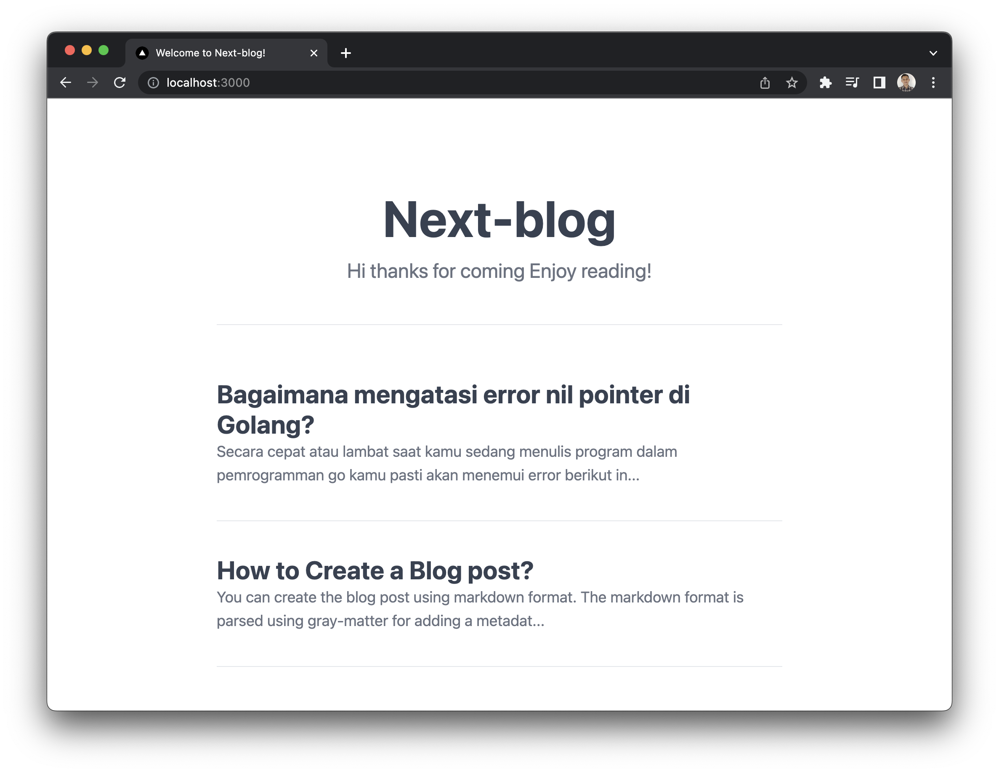

## Next.js Blog Example



Follow the tutorial [here](https://thewantara.com/posts/nextjs-blog)

## How to use?

Clone this repo.
```bash
git clone https://github.com/ahmadrosid/next-blog.git
```

Install dependencies.
```bash
yarn
```

Create new post
```bash
yarn post
> yarn run v1.22.19
> $ node ./lib/cli.js
> Create new blog post.
> Slug: test-post
> Title: Test post
> Tags: test-tag
> ./posts/test-post.md
> ✨  Done in 10.56s.
```

Update home page index.

```bash
yarn post --update-index
```
